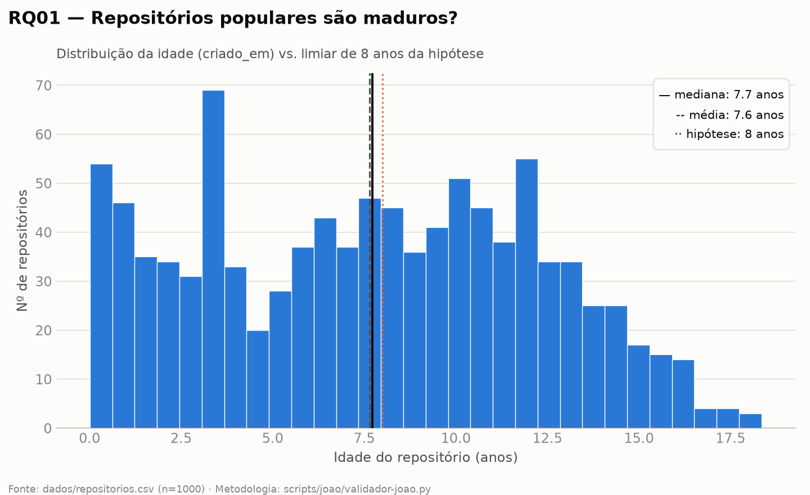
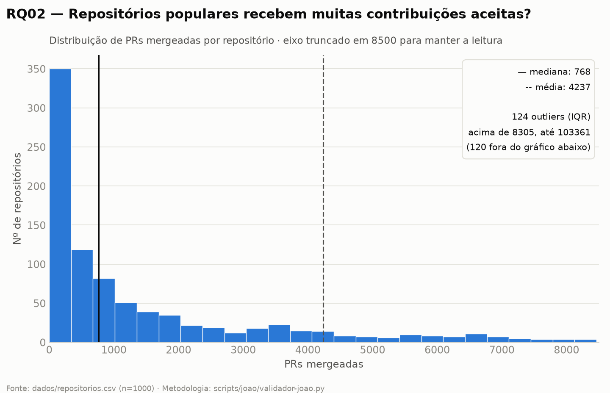
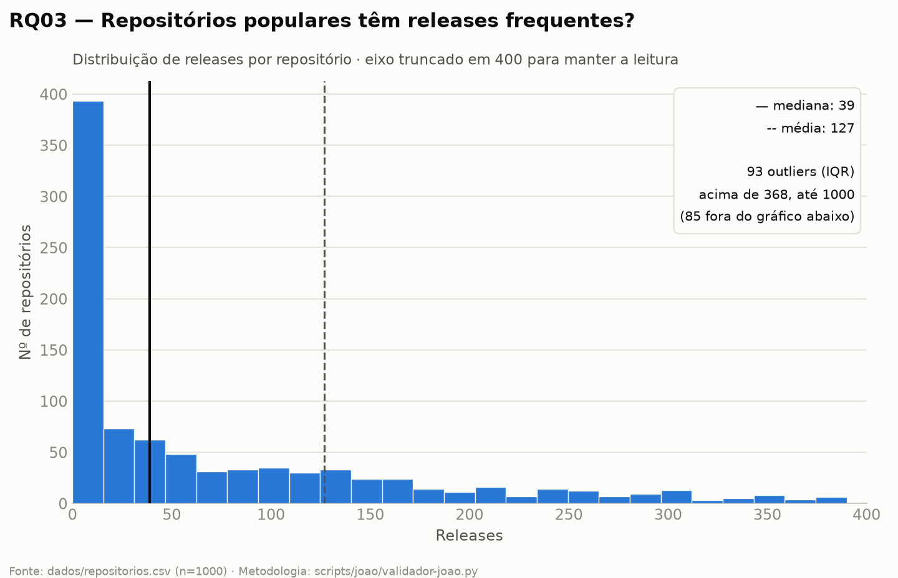
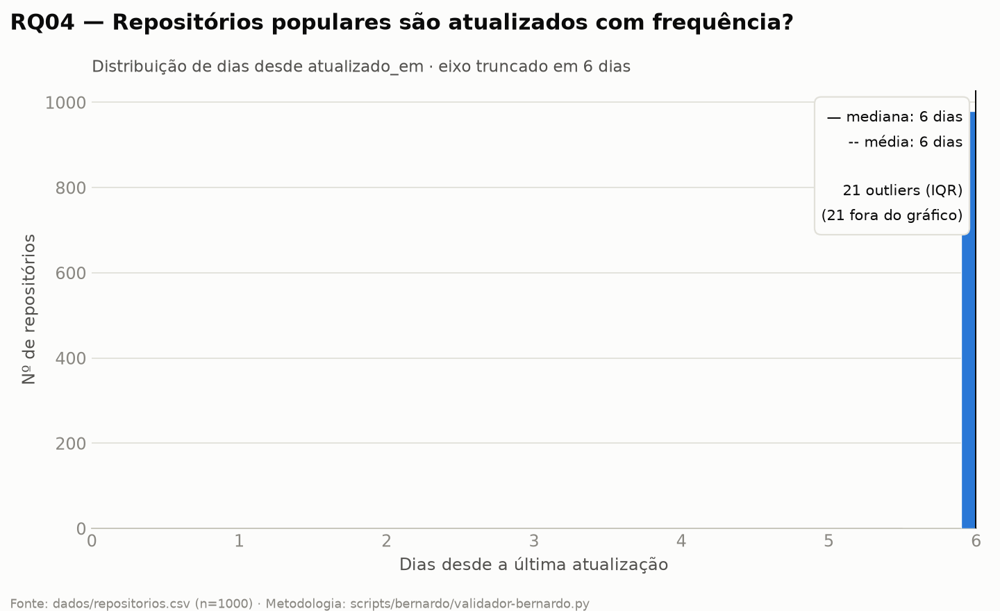
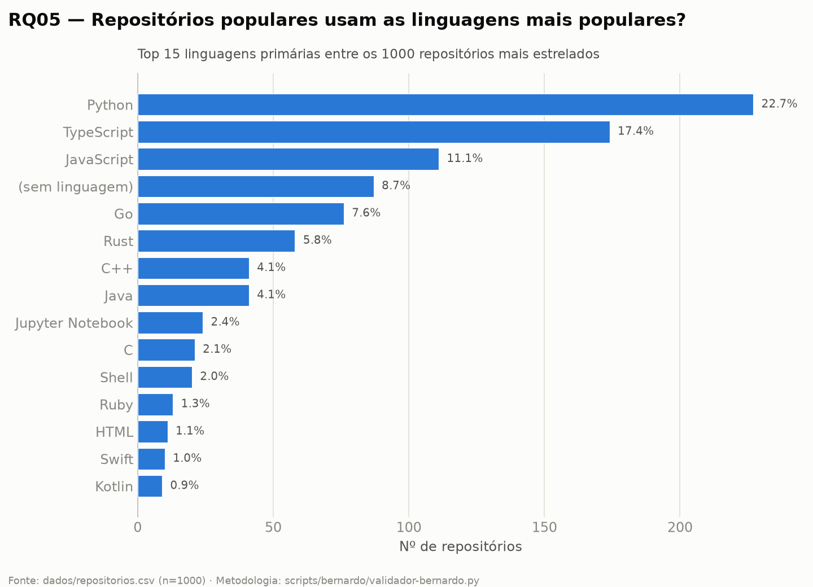
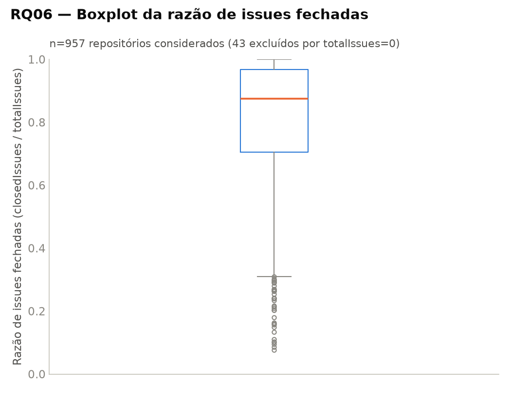
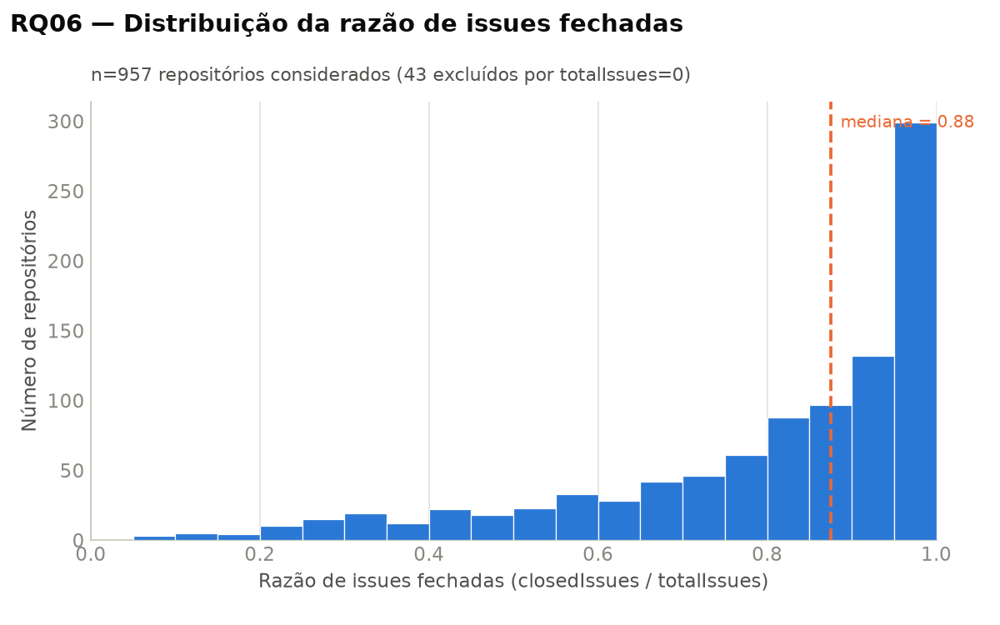
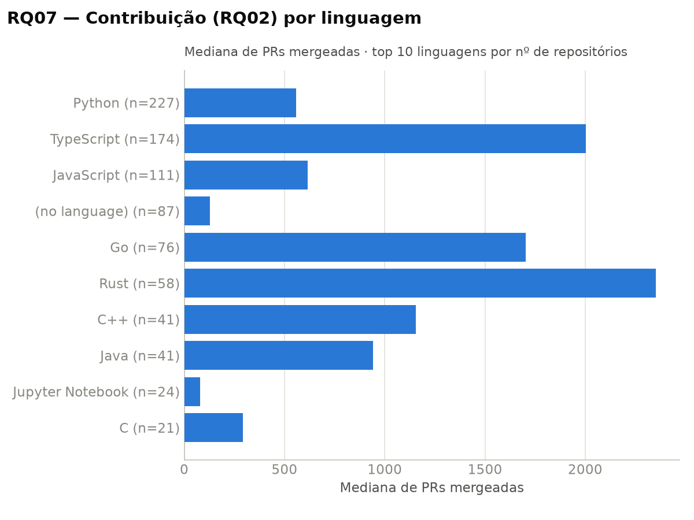
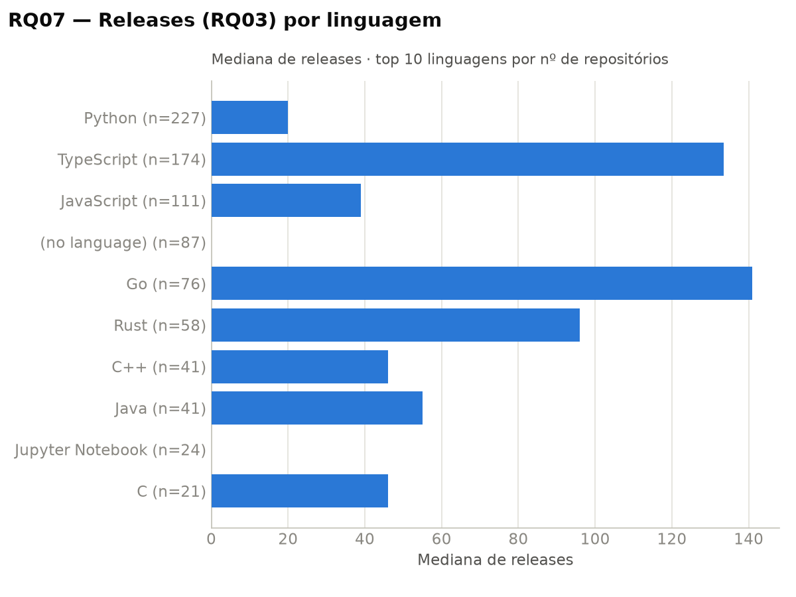
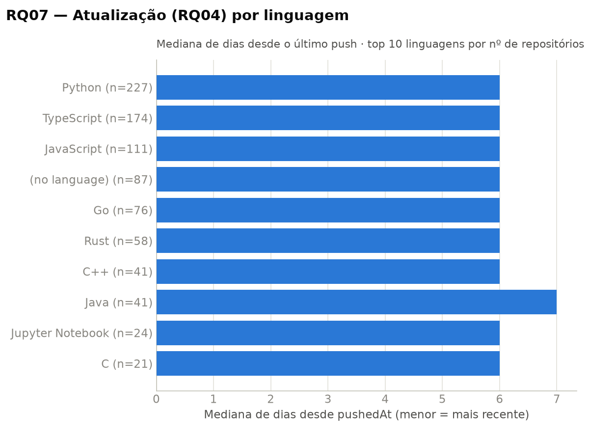

# Laboratório de Experimentação de Software - Características de repositórios populares

| | |
|---|---|
| **Curso** | Engenharia de Software |
| **Disciplina** | Laboratório de Experimentação de Software |
| **Turno / Período** | Noite / 6º |
| **Professor(a)** | Danilo Maia |
| **Laboratório** | Laboratório 01 — Características de repositórios populares |
| **Grupo (trio)** | Bernardo de Resende · João Marcelo · Miguel Diniz |
| **Link do repositório / GitHub Projects** | [https://github.com/joaomarcelocpa/LaboratorioExperimentacao/tree/main/Laboratorio1](https://github.com/joaomarcelocpa/LaboratorioExperimentacao/tree/main/Laboratorio1)   [https://github.com/users/joaomarcelocpa/projects/2/views/1](https://github.com/users/joaomarcelocpa/projects/2/views/1) |
| **Dashboard (GitHub Pages)** | [https://joaomarcelocpa.github.io/LaboratorioExperimentacao/Laboratorio1/dashboard.html](https://joaomarcelocpa.github.io/LaboratorioExperimentacao/Laboratorio1/dashboard.html) |
| **Data de entrega** | 27/08/2026 |

# 1. Introdução

Repositórios com muitas estrelas no GitHub são frequentemente tomados como referência de "boa prática" por desenvolvedores e times, considerados maduros, bem mantidos e escritos nas linguagens "certas", mas essa percepção raramente é checada contra dados. Este laboratório investiga empiricamente as características de sistemas open-source populares, coletando métricas de maturidade, contribuição externa, cadência de releases e atualizações, linguagem de implementação e gestão de issues para os 1.000 repositórios com maior número de estrelas do GitHub, via consulta própria à API GraphQL (sem bibliotecas de terceiros). Em paralelo, o laboratório também marca o início do uso do GitHub Projects (Kanban) do grupo, que acompanhará o processo de trabalho ao longo de todo o semestre.

As Questões de Pesquisa do enunciado, com as hipóteses informais levantadas pelo grupo antes da coleta, são:

- **RQ01 (Sistemas populares são maduros/antigos?)** Métrica: idade do repositório. Hipótese: sim, com idade mediana igual ou superior a 8 anos, já que acumular milhares de estrelas normalmente exige tempo.
- **RQ02 (Sistemas populares recebem muita contribuição externa?)** Métrica: total de pull requests aceitas. Hipótese: sim, volume alto de PRs mergeadas, pois projetos populares atraem colaboradores externos e mantenedores ativos.
- **RQ03 (Sistemas populares lançam releases com frequência?)** Métrica: total de releases. Hipótese: sim, releases frequentes, refletindo manutenção ativa e ciclo constante de entrega.
- **RQ04 (Sistemas populares são atualizados com frequência?)** Métrica: tempo até a última atualização. Hipótese: sim, atualização muito recente, com mediana de no máximo alguns dias.
- **RQ05 (Sistemas populares são escritos nas linguagens mais populares?)** Métrica: linguagem primária de cada repositório. Hipótese: sim, predomínio de linguagens de propósito geral e alta adoção no mercado, como Python e JavaScript/TypeScript.
- **RQ06 (Sistemas populares possuem um alto percentual de issues fechadas?)** Métrica: razão entre issues fechadas e total de issues. Hipótese: sim, razão alta, dada a presença de comunidades ativas e processos de triagem, ainda que a própria popularidade também gere um influxo constante de issues novas, o que pode manter parte relevante em aberto.
- **RQ07 (Sistemas escritos em linguagens mais populares recebem mais contribuição externa, lançam mais releases e são atualizados com mais frequência?)** Métricas de RQ02, RQ03 e RQ04, agrupadas por linguagem. Hipótese parcial: mais contribuição externa e atualizações mais frequentes em linguagens populares, mas sem diferença clara em releases, já que a cadência de releases parece mais associada à cultura de cada ecossistema do que à popularidade da linguagem em si.

Além do enunciado, o grupo propôs três frentes de inovação: (a) um teste estatístico inferencial (Mann-Whitney U) para RQ07, comparando linguagens populares e demais linguagens com significância estatística, e não apenas por comparação visual de medianas; (b) um dashboard HTML interativo, consumindo os dados de análise em JSON, como complemento aos gráficos estáticos exigidos; (c) scripts de validação de integridade dos dados com detecção automática de outliers (método IQR) e testes automatizados, cobrindo a qualidade da amostra antes da análise.

# 2. Contexto

Este projeto é o Laboratório 1, o primeiro laboratório do semestre, sem um laboratório anterior para se conectar. Ainda assim, ele estabelece a base de processo que os laboratórios seguintes vão usar: o GitHub Projects (Kanban) do grupo é criado e colocado em uso a partir daqui, e os snapshots de fechamento de sprint gerados nesta e nas próximas sprints alimentarão os Labs 04 e 05, que dependem do histórico de movimentação do board.

O objeto de estudo é o conjunto dos 1.000 repositórios com maior número de estrelas no GitHub, minerado por um script GraphQL próprio (`scripts/coleta.py`), sem uso de bibliotecas de terceiros para consulta à API. Para cada repositório são coletados: contagem de estrelas, data de criação, data de última atualização, linguagem primária, total de pull requests mergeadas, total de releases e contagem de issues abertas e fechadas.

Um ponto de definição conceitual relevante para a RQ05 e a RQ07 é a noção de "linguagem popular". A especificação sugere adotar uma fonte externa (TIOBE Index, GitHut ou GitHub Octoverse) e mantê-la ao longo de todo o laboratório. O grupo optou por não usar nenhuma dessas fontes e definiu "linguagem popular" operacionalmente a partir da própria amostra coletada: as linguagens mais populares são as top-N linguagens com maior número de repositórios entre os 1.000 coletados (ver `scripts/miguel/analyze_rq06_rq07.py`). Essa escolha é registrada com mais detalhe na seção 3.2 (Tomadas de Decisão) e mantida de forma consistente entre a RQ05 e a RQ07.

# 3. Metodologia

## 3.1 Principais Desafios

A API GraphQL do GitHub limita a busca por repositórios (`search`) a no máximo 100 nós por página e não retorna, na própria busca, estatísticas agregadas como PRs mergeadas, releases e issues. Por isso a coleta (`scripts/coleta.py`) foi dividida em duas etapas: primeiro uma busca paginada por estrelas (`stars:>1 sort:stars-desc`), navegando pelo cursor `endCursor` até reunir os 1.000 repositórios, e depois uma consulta separada por estatísticas, feita em lotes de 10 repositórios por requisição usando aliases GraphQL (`r0`, `r1`, ...), com até 3 lotes em paralelo. Requisições que retornavam erro 502, 503 ou 504 eram reenviadas com espera exponencial, para tolerar instabilidade pontual da API sem interromper a coleta de 1.000 repositórios.

O schema de dados também trouxe duas lacunas que exigiram tratamento. A primeira é a ausência de um campo `pushedAt` (data do último push de código): a coleta grava apenas `updatedAt` (`atualizado_em`), que também muda por motivos alheios ao código, como alteração de metadados do repositório. Como o enunciado da RQ04 e da RQ07 pede o tempo desde a última atualização, o grupo optou por tratar `atualizado_em` como proxy de `pushedAt`, documentando essa limitação nos scripts de validação e análise (`scripts/miguel/validate_rq06_rq07_integrity.py`, `scripts/miguel/analyze_rq06_rq07.py`). A segunda é a ausência de um `totalIssues` bruto e de uma chave única por repositório no CSV coletado: `totalIssues` precisou ser derivado somando `issues_abertas` e `issues_fechadas`, e a chave usada para checar duplicatas foi construída concatenando `autor` e `nome_repositorio`.

Por fim, 87 dos 1.000 repositórios (8,7% da amostra) não têm linguagem primária definida no GitHub, normalmente por serem repositórios de documentação, configuração ou conteúdo misto. Esse valor ausente é esperado e tratado como categoria própria ("sem linguagem") nas RQs 05 e 07, em vez de ser descartado ou imputado.

## 3.2 Tomadas de Decisão

**Limite de WIP.** A coluna Doing foi limitada a 3 itens simultâneos, um por integrante do trio. Como cada RQ (ou par de RQs) foi atribuída individualmente, o limite de 3 impede que um integrante puxe uma segunda tarefa para "Doing" antes de terminar a primeira, evitando trabalho paralelo fragmentado e mantendo o board como reflexo fiel do progresso real de cada um.

**Definição de "linguagem popular" (RQ05/RQ07).** Em vez de adotar uma fonte externa (TIOBE, GitHut ou GitHub Octoverse), o grupo definiu "linguagem popular" operacionalmente como as linguagens com maior número de repositórios dentro da própria amostra de 1.000 repositórios coletados (top-N por frequência, ver `scripts/miguel/analyze_rq06_rq07.py`). O trade-off dessa escolha é claro: o resultado reflete a composição da amostra estudada, não um ranking oficial da indústria, mas em compensação garante que a definição de "popular" usada na RQ07 é exatamente a mesma população medida na RQ05, sem depender de uma lista externa desatualizada ou de metodologia de coleta diferente da usada aqui.

**`atualizado_em` como proxy de `pushedAt` (RQ04/RQ07).** Como descrito em 3.1, a coleta não expõe o campo `pushedAt` do GitHub. O grupo decidiu usar `updatedAt` (`atualizado_em`) como proxy consistente em RQ04 e RQ07, documentando a limitação em vez de tentar reconstruir o dado por outra via (o que exigiria uma nova coleta e ultrapassaria o escopo do laboratório).

**Detecção de outliers.** Todos os validadores (`validador-joao.py`, `validador-bernardo.py`) usam o método IQR (1,5×IQR) de forma consistente entre RQ01-05, para que a mesma regra decida o que é outlier em qualquer métrica numérica da amostra.

**Divisão por zero em RQ06.** Repositórios com `totalIssues == 0` (nenhuma issue aberta nem fechada) foram excluídos do cálculo da razão `closedIssues / totalIssues`, já que a razão é indefinida nesse caso. A quantidade de repositórios excluídos é reportada à parte, em vez de ser omitida silenciosamente.

**Critério de inclusão de repositórios.** Não houve exclusão adicional de repositórios além do próprio critério de busca (`stars:>1`, ordenado por estrelas): os 1.000 primeiros repositórios retornados foram mantidos integralmente na amostra, incluindo os 87 sem linguagem primária definida, tratados como categoria própria em vez de removidos.

## 3.3 Etapas

### Configuração do processo

O board do grupo (GitHub Projects v2) usa as colunas `Backlog → To Do → Doing → Review → Done`, com limite de WIP de 3 itens na coluna Doing (um por integrante, ver 3.2). Cada tarefa do laboratório foi criada como Issue própria no repositório, atribuída a um responsável (campo Assignee), e referenciada pelo número nos commits correspondentes.

| Sprint              | Entregas | Responsável | Issues |
|---------------------|---|---|---|
| 01 (Dia 07 a 12/08) | Setup do script de coleta GraphQL, teste de conectividade com a API, extração dos 100 repositórios mais populares, gravação em CSV | João Marcelo; Bernardo; Miguel | #1, #2, #3 |
| 02 (Dia 17 a 19/08) | Paginação da coleta para 1.000 repositórios; validação de consistência e hipóteses informais de RQ01-03; validação de consistência e hipóteses informais de RQ04-05; validação de integridade dos dados e hipóteses informais de RQ06-07 | João Marcelo (RQ01-03); Bernardo (RQ04-05); Miguel (RQ06-07) | #6, #12, #13, #17, #18, #14, #15, #16 |
| 03 (Dia 20 a 26/08) | Gráficos de RQ01-03; gráficos de RQ04-05; gráficos, JSON de análise, dashboard e teste de Mann-Whitney para RQ06-07 | João Marcelo; Bernardo; Miguel | #19, #20, #21, #23 |

*Inserir aqui o print do quadro Kanban (GitHub Projects) ao final do laboratório.*

## 3.4 Ferramentas

**Mineração de dados.** Script GraphQL próprio (`scripts/coleta.py`), consumindo diretamente a API GraphQL do GitHub via `requests` 2.34, sem bibliotecas de terceiros de consulta à API. Autenticação via token pessoal carregado com `python-dotenv` 1.2. Saída formatada no terminal com `rich` 15.0.

**Ambiente e processamento de dados.** Python 3.12, com `pandas` para manipulação tabular e `pandera` para validação de schema dos dados coletados (tipos, domínio, nulidade, unicidade), usado nos validadores `scripts/joao/validador-joao.py`, `scripts/bernardo/validador-bernardo.py` e `scripts/miguel/validate_rq06_rq07_integrity.py`.

**Análise estatística.** `scipy.stats.mannwhitneyu` para o teste de Mann-Whitney U aplicado à RQ07 (inovação do grupo, seção 3.6), comparando linguagens populares e demais linguagens com significância estatística.

**Visualização.** `matplotlib` para os gráficos estáticos em PNG (um conjunto por integrante, em `dados/*/graficos/`). Como complemento, um dashboard HTML interativo (`dashboard.html`) com os dados embutidos e gráficos SVG desenhados sob medida, em HTML/CSS/JavaScript puro, sem biblioteca externa de gráficos nem dependência de CDN.

**Testes automatizados.** `pytest` 9.1, cobrindo o script de coleta (`scripts/test_coleta.py`) e os scripts de análise e validação de RQ06/RQ07 (`scripts/miguel/test_analyze_rq06_rq07.py`, `scripts/miguel/test_validate_rq06_rq07_integrity.py`).

**Ferramenta de processo.** GitHub Projects (v2), board do grupo disponível em [github.com/users/joaomarcelocpa/projects/2/views/1](https://github.com/users/joaomarcelocpa/projects/2/views/1), com os snapshots de sprint exportados por `scripts/snapshot_projects.py`.

## 3.5 Tabela de Métricas

| **RQ** | **Métrica** | **Definição Operacional** | **Unidade** | **Ferramenta / Fonte** |
|---|---|---|---|---|
| RQ01 | Idade do repositório | Data de referência da coleta menos `criado_em` (data de criação) | Anos | Script GraphQL próprio (`coleta.py`) + `validador-joao.py` |
| RQ02 | PRs mergeadas | Total de pull requests com estado MERGED (`prs_mergeadas`) | Contagem (PRs) | Script GraphQL próprio (`coleta.py`) + `validador-joao.py` |
| RQ03 | Releases | Total de releases do repositório (`releases`) | Contagem (releases) | Script GraphQL próprio (`coleta.py`) + `validador-joao.py` |
| RQ04 | Tempo até última atualização | Data de referência da coleta menos `atualizado_em` (proxy de `pushedAt`, ver 3.1/3.2) | Dias | Script GraphQL próprio (`coleta.py`) + `validador-bernardo.py` |
| RQ05 | Linguagem primária | `linguagem` (campo `primaryLanguage.name` do GitHub); contagem e % por linguagem sobre o total da amostra | Categórica (contagem/%) | Script GraphQL próprio (`coleta.py`) + `validador-bernardo.py` |
| RQ06 | Razão de issues fechadas | `issues_fechadas / (issues_abertas + issues_fechadas)`; repositórios com denominador 0 excluídos e reportados à parte (ver 3.2) | Razão (0-1) | Script GraphQL próprio (`coleta.py`) + `scripts/miguel/analyze_rq06_rq07.py` |
| RQ07 | PRs mergeadas, releases e tempo de atualização por linguagem | Mediana de `prs_mergeadas`, `releases` e dias desde `atualizado_em`, agrupada por `linguagem`; linguagens "populares" definidas como as top-N por número de repositórios na amostra (ver 3.2); comparação populares vs. demais testada com Mann-Whitney U | Mediana por grupo (dias/contagem) + p-valor | `scripts/miguel/analyze_rq06_rq07.py` (`scipy.stats.mannwhitneyu`) |

## 3.6 Inovações Propostas pelo Grupo (30% da nota)

**(a) Teste estatístico inferencial (Mann-Whitney U) para RQ07.** O enunciado pede apenas que RQ02, RQ03 e RQ04 sejam divididas por linguagem e comparadas; sem um teste, a comparação fica limitada a "a mediana do grupo A parece maior que a do grupo B no gráfico". O grupo foi além e aplicou o teste de Mann-Whitney U (`scipy.stats.mannwhitneyu`, em `scripts/miguel/analyze_rq06_rq07.py`) comparando o conjunto de linguagens populares contra as demais, para cada uma das três métricas, obtendo um p-valor que diz se a diferença observada é estatisticamente significativa ou pode ser efeito do acaso. O grupo considerou essa frente relevante porque a RQ07 é uma pergunta comparativa por natureza, e é exatamente o tipo de pergunta em que "parece diferente" e "é diferente" podem divergir, principalmente com uma amostra de 1.000 repositórios com distribuição assimétrica (mediana muito distante da média, como visto em RQ02 e RQ03). O resultado do teste aparece na Discussão da RQ07 (seção 4.3), usado para confirmar, refutar ou qualificar a hipótese informal levantada na Introdução.

**(b) Dashboard HTML interativo.** Além dos gráficos estáticos em PNG exigidos pelo enunciado (um por RQ), o grupo construiu um dashboard (`dashboard.html`) com os dados da amostra embutidos e gráficos SVG desenhados sob medida em HTML/CSS/JavaScript puro, sem biblioteca externa de visualização nem dependência de CDN, navegável por RQ. O grupo considerou essa frente relevante porque um dashboard interativo permite explorar a distribuição de cada métrica (filtrar, ver o valor exato ao passar o mouse, comparar linguagens) de um jeito que um PNG estático não permite, tornando os resultados mais acessíveis para quem for revisar o laboratório depois da entrega. O dashboard consome o mesmo `analysis_data.json` gerado pelos scripts de análise de RQ06/RQ07, então qualquer resultado mostrado nele é rastreável até o mesmo cálculo reportado na seção 4 (Resultados).

**(c) Validação automática de integridade dos dados.** Antes de calcular qualquer métrica, o grupo implementou uma camada de validação separada da análise: `validador-joao.py`, `validador-bernardo.py` e `validate_rq06_rq07_integrity.py` checam tipos, domínio (valores não-negativos, `issues_fechadas <= totalIssues`), nulidade, unicidade de repositório e detectam outliers pelo método IQR (1,5×IQR), cada um coberto por testes automatizados (`pytest`). O grupo considerou essa frente relevante porque a reprodutibilidade do laboratório depende da qualidade da amostra de 1.000 repositórios antes de qualquer hipótese ser testada, e separar validação de análise deixa explícito o que é problema de dado (ex.: os 87 repositórios sem linguagem) e o que é resultado de fato. Os relatórios de integridade (`dados/miguel/rq06-rq07-integridade.json`) e as contagens de valores ausentes/outliers aparecem na seção 4.1 (Coleta de Dados), sustentando a confiabilidade dos números discutidos nas demais RQs.

# 4. Resultados

## 4.1 Coleta de Dados

Dos 1.000 repositórios buscados e ordenados por estrelas, **1.000 foram efetivamente coletados e mantidos na amostra**, sem descarte por dados incompletos: o relatório de integridade (`dados/miguel/rq06-rq07-integridade.json`) confirma volume correto (1.000/1.000 linhas), schema válido (tipos, domínio não-negativo, `issues_fechadas <= totalIssues`, unicidade de repositório) e nenhuma linha com `atualizado_em` inválido ou no futuro. A coleta foi realizada com data de referência em torno de 19/08/2026, usada nos cálculos de idade (RQ01) e tempo desde a última atualização (RQ04/RQ07).

O único valor ausente relevante é a linguagem primária: **87 dos 1.000 repositórios (8,7%)** não têm `linguagem` definida no GitHub, tipicamente por serem repositórios de documentação, configuração ou conteúdo misto. Esses registros não foram descartados; foram mantidos e contados como categoria própria ("sem linguagem") nas RQ05 e RQ07, já que excluí-los enviesaria a amostra para repositórios "mais tradicionais" de código.

Outliers foram identificados pelo método IQR (1,5×IQR), aplicado de forma consistente a todas as métricas numéricas, sem remoção da amostra (reportados à parte, não descartados):

| Métrica | Valores ausentes | Outliers (IQR) | % da amostra |
|---|---|---|---|
| RQ01 (`criado_em`) | 0 | 0 | 0% |
| RQ02 (`prs_mergeadas`) | 0 | 123 | 12,3% |
| RQ03 (`releases`) | 0 | 92 | 9,2% |
| RQ04 (`atualizado_em`) | 0 | 99 | 9,9% |
| RQ05 (`linguagem`) | 87 | não aplicável | 8,7% (ausentes) |

Para a RQ06, dos 1.000 repositórios, **43 (4,3%) têm `totalIssues == 0`** (nenhuma issue aberta nem fechada) e foram excluídos do cálculo da razão `closedIssues / totalIssues`, por a razão ser indefinida nesse caso (política registrada em 3.2). A RQ06 foi calculada, portanto, sobre **957 repositórios**.

Para a RQ07, as linguagens "populares" (top-10 por número de repositórios na amostra, ver 3.2) são: C, C++, Go, Java, JavaScript, Jupyter Notebook, Python, Rust, Shell e TypeScript. A comparação com as demais linguagens foi feita sobre esse recorte.

## 4.2 Visualização Gráfica

**RQ01 (Sistemas populares são maduros/antigos?)**

Mediana de **7,7 anos** desde a criação (data de criação mediana: 24/11/2018; data de referência: 18/08/2026), sem outliers identificados pelo método IQR.

**RQ02 (Sistemas populares recebem muita contribuição externa?)**

Mediana de **768 pull requests mergeadas** por repositório. A média (4.216,08) é bem mais alta que a mediana, refletindo distribuição assimétrica puxada por 123 repositórios outliers (12,3% da amostra).

**RQ03 (Sistemas populares lançam releases com frequência?)**

Mediana de **39,5 releases** por repositório. Assim como em RQ02, a média (127,39) muito acima da mediana e os 92 outliers (9,2%) indicam forte assimetria, com um grupo pequeno de projetos com volume de releases muito acima do típico.

**RQ04 (Sistemas populares são atualizados com frequência?)**

Mediana de **1,0 dia** desde a última atualização (`atualizado_em`), com média de 1,11 dia, indicando que a grande maioria dos repositórios foi atualizada no próprio dia ou no dia anterior à coleta. 99 outliers (9,9%) representam repositórios com atualização mais distante.

**RQ05 (Sistemas populares são escritos nas linguagens mais populares?)**

Python lidera com **22,9%** dos repositórios, seguido de TypeScript (17,4%) e JavaScript (11,1%), e as três juntas somam 51,4% da amostra. 87 repositórios (8,7%) não têm linguagem definida.

**RQ06 (Sistemas populares possuem um alto percentual de issues fechadas?)**

Mediana da razão `issues_fechadas / totalIssues` de **0,875 (87,5%)**, com média de 0,802 (80,2%), calculada sobre os 957 repositórios com `totalIssues > 0` (43 excluídos por divisão indefinida).

**RQ07 (Sistemas escritos em linguagens mais populares recebem mais contribuição externa, lançam mais releases e são atualizados com mais frequência?)**

Comparando as 10 linguagens populares (793 repositórios) contra as demais (120 repositórios), via teste de Mann-Whitney U:

| Métrica | Mediana (populares) | Mediana (demais) | p-valor | Significativo (α=0,05) |
|---|---|---|---|---|
| PRs mergeadas | 997 | 658 | 0,142 | Não |
| Releases | 57 | 21,5 | 0,0004 | **Sim** |
| Dias desde atualização | 6,0 | 6,0 | 0,512 | Não |

## 4.3 Discussão

**RQ01 (idade).** Hipótese parcialmente confirmada. A mediana de 7,7 anos mostra repositórios maduros, mas fica abaixo do limiar de 8 anos previsto na hipótese: acumular popularidade no GitHub, hoje, parece exigir um pouco menos tempo do que o grupo esperava, possivelmente porque o próprio ecossistema (número de desenvolvedores, viralização de projetos) cresceu nos últimos anos.

**RQ02 (PRs mergeadas).** Hipótese confirmada. Mediana de 768 PRs mergeadas indica volume alto de contribuição externa. A diferença grande entre mediana e média (4.216,08) mostra que esse volume não é uniforme: um grupo pequeno de repositórios (os 123 outliers, 12,3%) concentra uma quantidade de contribuições muito acima do resto, então "alto volume de contribuição" já é a norma, mas "volume extremo" é exceção.

**RQ03 (releases).** Hipótese confirmada. Mediana de 39,5 releases por repositório é compatível com manutenção ativa e ciclo de entrega recorrente. Como em RQ02, a assimetria (média de 127,39, 92 outliers) indica que um subconjunto de projetos lança releases com frequência muito acima da mediana, provavelmente ligados a práticas de versionamento automatizado (ex.: um release por PR ou por dependência atualizada).

**RQ04 (atualização).** Hipótese fortemente confirmada. Mediana de 1,0 dia desde a última atualização, com média quase idêntica (1,11), mostra uma distribuição concentrada: a esmagadora maioria dos repositórios populares foi tocada no próprio dia ou no dia anterior à coleta, sem o mesmo padrão de cauda longa observado em RQ02/RQ03.

**RQ05 (linguagem).** Hipótese confirmada. Python (22,9%), TypeScript (17,4%) e JavaScript (11,1%) dominam a amostra, somando 51,4%. A presença de Go e Rust em 4º e 5º lugar sugere que, além das linguagens de propósito geral já esperadas, linguagens compiladas voltadas a performance também vêm ganhando espaço relevante entre os projetos mais populares.

**RQ06 (issues fechadas).** Hipótese confirmada, com ressalva. Mediana de 87,5% de issues fechadas é uma razão alta, como previsto. Mas a média (80,2%) mais baixa que a mediana, com uma cauda puxando para baixo, é coerente com a ressalva que constava na própria hipótese: a popularidade também atrai um fluxo constante de issues novas, e uma parte dos repositórios (os 43 excluídos por não ter nenhuma issue, e outros com razão mais baixa) foge do padrão de "quase tudo fechado".

**RQ07 (linguagem popular vs. contribuição/releases/atualização).** Hipótese refutada na direção específica prevista, embora "parcialmente confirmada" no formato geral. O grupo esperava diferença significativa em PRs mergeadas e em frequência de atualização, e nenhuma diferença clara em releases. O teste de Mann-Whitney U mostrou exatamente o oposto: **releases foi a única métrica com diferença estatisticamente significativa** (mediana de 57 releases em linguagens populares contra 21,5 nas demais, p = 0,0004, muito abaixo de α = 0,05), enquanto PRs mergeadas (p = 0,142) e dias desde a última atualização (mediana idêntica de 6,0 em ambos os grupos, p = 0,512) não mostraram diferença estatisticamente significativa. Em linguagem acessível: **não dá para afirmar, com confiança estatística, que repositórios em linguagens populares recebem mais PRs ou são atualizados com mais frequência que os demais**: a diferença observada nos gráficos de barra poderia ser efeito do acaso. Já a diferença em releases é real e expressiva. Uma explicação plausível é que o ecossistema de ferramentas de publicação de pacotes das linguagens mais populares (npm, PyPI, Cargo, Go modules) incentiva um ciclo de releases mais curto e automatizado, enquanto o volume de PRs e a frequência de atualização já estão "saturados" no topo do ranking de estrelas, independentemente da linguagem, ou seja: entrar no top-1.000 por estrelas já filtra para projetos ativamente mantidos, esvaziando parte do efeito da linguagem sobre essas duas métricas.

**Ameaças à validade.** (i) A coleta é um retrato de um único instante (~19/08/2026); o ranking de estrelas muda constantemente, então os mesmos 1.000 repositórios não seriam necessariamente os mesmos em outra data, e nenhuma tendência ao longo do tempo é capturada. (ii) `atualizado_em` é usado como proxy de `pushedAt` (RQ04/RQ07): como `updatedAt` também muda por motivos alheios ao código (ex.: edição de metadados do repositório), a métrica de "frequência de atualização" pode estar superestimando a atividade real de código. (iii) A definição de "linguagem popular" (RQ05/RQ07) é relativa à própria amostra coletada, não a uma fonte externa; os resultados são válidos para caracterizar este conjunto de 1.000 repositórios, mas não podem ser generalizados diretamente como "a linguagem X é mais popular no mercado". (iv) A exclusão de 43 repositórios com `totalIssues == 0` em RQ06 é uma decisão razoável e documentada, mas reduz ligeiramente o tamanho da amostra analisada (957 de 1.000).

**Contribuição das inovações (seção 3.6).** O teste de Mann-Whitney U (inovação a) foi o que revelou o resultado mais importante da Discussão: sem ele, o grupo teria concluído, olhando só os gráficos de barra, que havia diferença "visível" em todas as três métricas de RQ07, quando na verdade duas dessas diferenças não são estatisticamente confiáveis. A inovação, portanto, **contradisse** parte da leitura ingênua dos 70% do enunciado, corrigindo a hipótese informal em vez de apenas confirmá-la. A validação automática de integridade (inovação c) sustentou a confiança nos números usados em toda a Discussão, ao confirmar antecipadamente que a amostra de 1.000 repositórios estava íntegra (schema válido, sem datas inválidas ou futuras) e ao quantificar com precisão os casos de dado ausente (87 sem linguagem) e indefinido (43 com `totalIssues == 0`) usados nas RQs 05, 06 e 07. O dashboard interativo (inovação b) não altera nenhum resultado, mas **aprofunda** o acesso a eles, permitindo explorar a mesma distribuição por trás de cada gráfico estático apresentado aqui.

# 5. Conclusão

No geral, a imagem de "repositório popular como sinônimo de projeto maduro e bem cuidado" se sustentou: os 1.000 repositórios mais estrelados do GitHub são, em sua maioria, projetos antigos, ativamente atualizados quase todo dia, com boa parte das issues fechadas e concentrados em um pequeno grupo de linguagens de propósito geral. Ao mesmo tempo, os dados mostraram que esse retrato tem nuances importantes: a maturidade típica é um pouco menor do que o grupo esperava, e as métricas de contribuição e de releases são fortemente assimétricas, puxadas por um subconjunto pequeno de mega-projetos, não pela mediana da amostra como um todo.

O ponto mais relevante da investigação, no entanto, veio da RQ07. A narrativa intuitiva de que "linguagem popular atrai mais contribuição e mantém atualização mais frequente" não resistiu ao teste estatístico: a única diferença comprovadamente significativa entre linguagens populares e demais foi na frequência de releases, não em PRs mergeadas nem em atualização. Isso sugere que, uma vez que um repositório já entrou no topo do ranking de estrelas, a linguagem em que ele é escrito deixa de ser um fator determinante para a maior parte das métricas de atividade, algo que só ficou visível porque o grupo optou por ir além da comparação visual de medianas.

O estudo tem limitações que merecem ser explicitadas. A amostra é um retrato de um único instante de coleta, não uma série temporal, o que impede qualquer afirmação sobre tendência de crescimento ou declínio dessas características. A definição de "linguagem popular" foi construída a partir da própria amostra, não de uma fonte de mercado externa, então os resultados de RQ05 e RQ07 devem ser lidos como uma caracterização deste conjunto de 1.000 repositórios, não como uma afirmação geral sobre o mercado de linguagens. E o uso de `atualizado_em` como proxy de `pushedAt` é uma aproximação razoável, mas imperfeita, para "atividade de código".

Com mais tempo, o grupo repetiria a coleta em pontos diferentes do semestre para transformar o retrato único em uma série temporal, e buscaria uma forma de captar o último push de código diretamente (via API de commits), em vez de depender de `updatedAt` como proxy. Das três inovações propostas, a que mais vale a pena expandir é o teste estatístico: hoje ele cobre só a RQ07, mas o mesmo tipo de teste poderia ser aplicado a outras comparações da amostra (ex.: repositórios com e sem linguagem definida, ou por faixa de idade), e a validação de integridade já deixou pronto, em comentário no próprio script, o caminho para rodar essas checagens automaticamente a cada atualização dos dados via GitHub Actions.

# 6. Referências

- ZUSE, Horst. A framework of software measurement. Walter de Gruyter, 2013.
- MANN, H. B.; WHITNEY, D. R. On a Test of Whether one of Two Random Variables is Stochastically Larger than the Other. Annals of Mathematical Statistics, v. 18, n. 1, p. 50-60, 1947. Implementação usada: `scipy.stats.mannwhitneyu` ([docs.scipy.org](https://docs.scipy.org/doc/scipy/reference/generated/scipy.stats.mannwhitneyu.html)).
- GITHUB. GraphQL API Docs. Disponível em: [https://docs.github.com/graphql](https://docs.github.com/graphql). Fonte primária de todos os dados coletados no laboratório.