## Laboratório de Experimentação de Software — Assistentes de IA vs. Codificação Manual

| | |
|---|---|
| **Curso** | Engenharia de Software |
| **Disciplina** | Laboratório de Experimentação de Software |
| **Turno / Período** | Noite / 6º |
| **Professor(a)** | Danilo Maia |
| **Laboratório** | Laboratório 02 — Assistentes de IA vs. Codificação Manual |
| **Grupo (trio)** | Bernardo de Resende · João Marcelo · Miguel Diniz |
| **Link do repositório / GitHub Projects** | [https://github.com/joaomarcelocpa/LaboratorioExperimentacao/tree/main/Laboratorio2](https://github.com/joaomarcelocpa/LaboratorioExperimentacao/tree/main/Laboratorio2)   [https://github.com/users/joaomarcelocpa/projects/2](https://github.com/users/joaomarcelocpa/projects/2) |
| **Data de entrega** | 24/04/2026 |

# 1. Introdução

Ferramentas de IA generativa (GitHub Copilot, ChatGPT, Claude, Gemini etc.) se
tornaram onipresentes no desenvolvimento de software, mas ainda há pouca
evidência controlada e reproduzível sobre seu real impacto em produtividade e
qualidade — a maior parte do que se ouve é relato anedótico. Este laboratório
propõe um experimento controlado (crossover, within-subject, time-boxed) para
avaliar quantitativamente os efeitos do uso de um assistente de IA (Claude Sonnet 5) na
resolução de katas de programação, comparando-o à codificação manual.

**Questões de Pesquisa (do enunciado):**

- **RQ1** — O uso de assistente de IA reduz o tempo necessário para resolver
  uma tarefa de programação?
- **RQ2** — O uso de assistente de IA reduz a quantidade de defeitos (testes
  que falham) no código produzido?
- **RQ3** — O uso de assistente de IA altera a complexidade ciclomática ou a
  duplicação do código produzido?

**Hipóteses informais do grupo (antes da coleta):**

| RQ | H0 | H1 |
|---|---|---|
| RQ1 | O tempo até passar em todos os testes de aceitação é igual, com ou sem IA | O uso de IA reduz esse tempo |
| RQ2 | A taxa de testes de aceitação passando ao final do time-box é igual, com ou sem IA | O uso de IA aumenta essa taxa |
| RQ3 | A complexidade ciclomática e a duplicação do código são iguais, com ou sem IA | O uso de IA altera essas métricas |

**Inovações do grupo além do enunciado (30%, detalhadas na seção 3.6):**

- Análise das métricas de Halstead (volume, dificuldade, esforço, bugs
  estimados) — já coletadas pelo Radon desde a Sprint 1, mas nunca usadas em
  nenhuma análise até esta sprint.
- Classificação do LOC por tipo (diretivas, declarativas, executáveis, em
  branco, comentário), via AST própria, para identificar **onde** exatamente
  a diferença de LOC entre tratamentos acontece.
- Dashboard HTML interativo (além dos gráficos estáticos exigidos), com
  navegação por abas, pareamento visual por kata e alternância de métrica.

# 2. Contexto

Este é o **Laboratório 02** da disciplina, situado logo após o Laboratório 01
(mineração de repositórios populares do GitHub). Diferente do Lab01, que
analisava um dataset observacional de terceiros, o Lab02 é um **experimento
controlado conduzido pelo próprio grupo**: os três integrantes são, ao mesmo
tempo, os sujeitos experimentais e os pesquisadores.

O objeto de estudo é o **processo de resolução de katas de programação**
(exercícios do LeetCode) sob duas condições (tratamentos): com assistente de
IA habilitado e sem nenhuma assistência externa. Cada trial é cronometrado e,
ao final, o código produzido passa por testes de aceitação e por análise
estática (Radon), gerando três frentes de medição: tempo, defeitos e
estrutura do código — alinhadas ao método **GQM (Goal-Question-Metric)** de
Basili, Caldiera & Rombach, explicitamente adotado na especificação do
laboratório para conectar o objetivo geral (comparar IA vs. manual) às
questões de pesquisa e métricas candidatas.

A ferramenta de métricas estáticas usada é o **Radon**, compatível com a
linguagem escolhida pelo grupo (**Python**) — decisão detalhada na seção 3.2.

# 3. Metodologia

## 3.1 Principais Desafios

- **Padronizar katas de dificuldade comparável e baixa indexação.** O maior
  risco de validade deste experimento é a IA (ou o próprio integrante) já
  "conhecer" a solução de memória, em vez de efetivamente resolver o
  problema. O grupo evitou katas clássicos (Top Interview 150, Blind 75) e
  priorizou katas com baixo número de resoluções no LeetCode — ver `README.md`
  seção 9 (Ameaças à Validade).

- **Redesenho do projeto experimental no meio do caminho.** O desenho
  original previa cada integrante resolvendo todos os 6 katas (metade com IA,
  metade sem). Com apenas 2 katas por nível de dificuldade e 3 integrantes,
  essa divisão gerava desproporção — pelo menos dois integrantes acabariam
  repetindo a mesma combinação de tratamento por dificuldade. O grupo migrou
  para um **rodízio contrabalanceado por pares** (cada kata resolvido
  exatamente uma vez manual e uma vez com IA, sempre por integrantes
  diferentes), reduzindo de 6 para 4 trials por integrante, mas garantindo
  que cada kata fosse testado exatamente uma vez em cada tratamento.

- **Divergência de convenção de nomes entre integrantes.** João e Bernardo
  nomearam seus arquivos de solução por tratamento e dificuldade
  (`ai-easy.py`, `manual-medium.py`), enquanto Miguel nomeou pelo nome do
  próprio kata (`additiveNumber.py`). Isso exigiu uma lógica de mapeamento
  explícita (kata → arquivo) na consolidação dos dados da Sprint 3
  (`scripts/consolidar_dados.py`) para conseguir juntar corretamente tempo,
  taxa de sucesso e métricas estáticas de cada trial.

- **Amostra pequena (N=6 pares por métrica).** Com N tão pequeno, o teste de
  Wilcoxon exato não é calculável quando há empates entre os pares — o SciPy
  recorre então à aproximação normal, o que o grupo precisou identificar e
  documentar explicitamente (campo `aviso_amostra_pequena` no JSON de
  resultados), em vez de reportar o p-valor sem essa ressalva.

- **Avaliar e descartar métricas CK (aprofundamento).** O grupo tentou
  estender a análise da RQ3 com métricas inspiradas em CK (WMC, DIT, NOC,
  CBO, RFC, LCOM), implementadas via AST própria. Na prática, a maioria dessas
  métricas mede relação **entre** classes (herança, acoplamento, coesão), e
  cada kata deste experimento é resolvido em uma única classe `Solution` sem
  hierarquia — DIT e NOC saíram constantes em 0 nos dois tratamentos, e LCOM
  só era definível quando a classe tinha 2+ métodos (só 1 dos 12 trials). O
  grupo decidiu descartar essa frente e investir, em vez disso, na
  classificação detalhada do LOC (ver seção 3.6), que se mostrou mais
  informativa para este tipo de código.

## 3.2 Tomadas de Decisão

- **Assistente de IA: Claude Sonnet 5, fixo em todos os 6 trials com
  IA.** Usar o mesmo assistente do início ao fim garante que o tratamento
  "com IA" seja comparável dentro do próprio experimento — trocar de
  ferramenta entre trials introduziria uma variável de confusão.

- **Linguagem: Python, métricas via Radon (não CK/Java).** A especificação
  permite essa substituição explicitamente quando a linguagem escolhida não é
  Java. Python foi escolhido pela familiaridade do trio com a linguagem, o
  que reduz a chance de o tempo de resolução ser dominado por fricção com a
  sintaxe em vez do algoritmo em si.

- **Rodízio por pares em vez de mesma pessoa nos dois tratamentos do mesmo
  kata.** Trade-off explícito: perde-se controle total sobre a habilidade
  individual como variável de confusão (quem resolveu manual e quem resolveu
  com IA em um dado kata são pessoas diferentes), mas ganha-se uma divisão
  perfeitamente proporcional — cada um dos 6 katas é testado exatamente uma
  vez em cada tratamento, o que não seria possível com apenas 3 integrantes e
  2 katas por dificuldade sob o desenho original.

- **Pareamento estatístico por kata, não por integrante.** Consequência
  direta da decisão anterior: o teste de Wilcoxon (amostras pareadas) compara
  o par (manual, com IA) de cada um dos 6 katas — não o par de trials de uma
  mesma pessoa. Essa é a unidade de pareamento consistente com o desenho
  acima (ver `scripts/analise_estatistica.py::_pares_por_kata`).

- **Time-box de 35 minutos, sem redução.** A especificação permite reduzir o
  limite (nunca aumentar); o grupo optou por manter o valor de referência de
  35 min, e nenhum dos 12 trials precisou dele por inteiro (o maior trial
  manual levou 27min22s).

- **Limiar de duplicação: blocos de 5+ linhas repetidas.** Parâmetro
  `_MIN_DUP_LINES = 5` em `scripts/metricas_radon.py`, aplicado via janela
  deslizante com hash MD5 — equivalente funcional ao PMD CPD/jscpd citados na
  especificação, adaptado para Python.

## 3.3 Etapas

| Sprint | Entregas | Responsável(is) | Issues |
|---|---|---|---|
| **S01** — Desenho + Preparação | Desenho do experimento (hipóteses, katas, ameaças à validade); script de cronometragem (Tkinter); script de métricas Radon + detecção de duplicação; script de sorteio/distribuição dos katas | João Marcelo (desenho, sorteio); Miguel Diniz (cronometragem); Bernardo de Resende (métricas Radon) | #24, #25, #26, #27 |
| **S02** — Execução + Coleta | Resolução dos 6 katas (metade manual, metade com IA, por integrante, ordem contrabalanceada) e registro dos 12 trials | João Marcelo, Miguel Diniz, Bernardo de Resende (cada um resolveu seus próprios katas e registrou seus trials) | #28, #29, #30 |
| **S03** — Análise + Dashboard | Métricas Radon finais com Halstead; consolidação dos 12 trials; análise estatística (Wilcoxon) de RQ1–RQ3; classificação de LOC por tipo; dashboard estático (PNG) e interativo (HTML) | Miguel Diniz (Halstead); Bernardo de Resende (métricas finais); João Marcelo (consolidação, análise estatística, dashboards) | #31, #32, #33, #35 |

### Configuração do processo

O grupo usa um único quadro Kanban no GitHub Projects (v2), compartilhado por
todos os laboratórios da disciplina — cada laboratório tem sua própria coluna
"Done" (ex.: "Done - Laboratório 1", "Done - Laboratório 2"), o que preserva o
histórico completo de todas as issues já concluídas no semestre em um só
lugar, em vez de um board por laboratório.

- Colunas do board: Doing → Review → Done - Laboratório 1 → Done - Laboratório 2 (uma coluna "Done" por laboratório da disciplina).
- Limite de WIP: a coluna Doing é mantida com o menor número possível de itens simultâneos por integrante (idealmente 1) — na captura abaixo, ao final da Sprint 3, está em 0 (todas as issues do Lab02 já haviam sido concluídas e movidas para "Done - Laboratório 2").

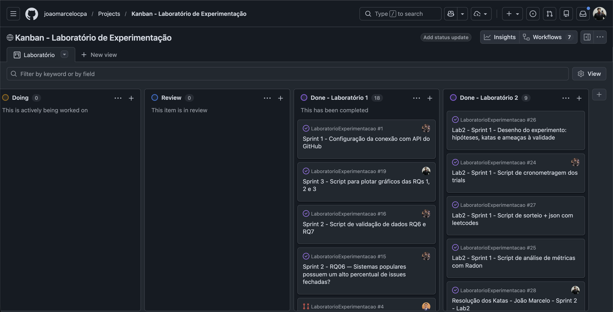

*Board: [https://github.com/users/joaomarcelocpa/projects/2](https://github.com/users/joaomarcelocpa/projects/2). As issues #24–#35 referenciadas na tabela de sprints acima aparecem em "Done - Laboratório 2", confirmando a rastreabilidade entre o board e os commits deste laboratório.*

## 3.4 Ferramentas

- **Python 3.9** — linguagem dos katas e de todos os scripts do experimento.
- **Radon 6.0.1** — complexidade ciclomática (`cc`), índice de manutenibilidade
  (`mi`), métricas de Halstead (`hal`) e linhas de código brutas (`raw`);
  `scripts/metricas_radon.py`.
- **Tkinter** — interface gráfica de cronometragem dos trials
  (`scripts/cronometragem.py`), com limite de 35 min e formatação de tempo.
- **AST (biblioteca padrão do Python)** — classificação de LOC por tipo
  (`scripts/metricas_loc.py`), usada na inovação da seção 3.6.
- **Pandas + Matplotlib/Seaborn** — consolidação e geração dos gráficos do
  dashboard estático (`scripts/dashboard.py`).
- **SciPy (`scipy.stats.wilcoxon`)** — teste de Wilcoxon para amostras
  pareadas, usado na análise inferencial de RQ1–RQ3 e das métricas de
  aprofundamento (`scripts/analise_estatistica.py`).
- **Claude (versão gratuita)** — assistente de IA usado em todos os 6 trials
  com IA.
- **GitHub Projects (v2)** — ferramenta de processo, board do grupo:
  [https://github.com/users/joaomarcelocpa/projects/2](https://github.com/users/joaomarcelocpa/projects/2).

## 3.5 Tabela de Métricas

| **RQ** | **Métrica** | **Definição Operacional** | **Unidade** | **Ferramenta / Fonte** |
|---|---|---|---|---|
| RQ1 | Tempo até passar em todos os testes ("time-to-green") | Tempo cronometrado do início do trial até todos os testes de aceitação passarem, ou até o time-box de 35 min esgotar (trial censurado) | Segundos | `scripts/cronometragem.py` → `dados/*/trials.csv` |
| RQ2 | Taxa de sucesso dos testes de aceitação | `testes_passados / testes_total × 100`, medida ao final do time-box | % | `dados/*/trials.csv` (testes próprios de cada trial) |
| RQ3 | Complexidade ciclomática média | Média da complexidade McCabe de cada bloco (função/método) do arquivo, via `radon.complexity.cc_visit` | Adimensional | Radon `cc` |
| RQ3 | Duplicação de código | % de linhas significativas (não vazias, não comentário) contidas em algum bloco de 5+ linhas repetido, via janela deslizante + hash MD5 | % | `scripts/metricas_radon.py::_detectar_duplicatas` |
| RQ3 | LOC (métrica de controle) | Total de linhas físicas do arquivo, via `radon.raw.analyze` | Linhas | Radon `raw.loc` |
| RQ3 (opcional) | Índice de manutenibilidade (MI) | Métrica composta (complexidade + LOC + volume de Halstead), via `radon.metrics.mi_visit` | 0–100 | Radon `mi` |
| Aprofundamento | Halstead (volume, dificuldade, esforço, bugs estimados) | Fórmulas de Halstead sobre operadores/operandos únicos e totais do arquivo, via `radon.metrics.h_visit` | Adimensional / segundos (tempo estimado) | Radon `hal` |
| Aprofundamento | LOC por tipo (diretivas, declarativas, executáveis) | Classificação, via AST, de cada linha física em `import`/`from import` (diretiva), assinatura de `class`/`def`/`global`/`nonlocal`/anotação sem valor (declarativa), ou demais comandos (executável) | Linhas | `scripts/metricas_loc.py` |

## 3.6 Inovações Propostas pelo Grupo (30% da nota)

O grupo propôs duas frentes de inovação, ambas classificáveis como **(b)
métrica/variável adicional não pedida no enunciado**, e uma frente de
**(c) mudança de arquitetura na visualização**:

**1. Métricas de Halstead (aprofundamento de RQ3).** A especificação só pede,
como aprofundamento opcional, o Índice de Manutenibilidade (MI) — que já
incorpora Halstead internamente, mas sem expor os componentes. O Radon já
calculava Halstead completo desde a Sprint 1 (por exigência do próprio
grupo, commit `#31`), mas nenhum dado dessa coleta havia sido efetivamente
analisado até esta sprint. O grupo decidiu extrair e testar estatisticamente
volume, dificuldade, esforço e bugs estimados, comparando manual vs. IA. As 4
métricas deram **significativas** (Wilcoxon p = 0,0312), todas a favor da
IA — resultado discutido na seção 4.3, incluindo uma divergência interessante
com a RQ2 (bugs estimados vs. bugs observados).

**2. Classificação de LOC por tipo (aprofundamento de RQ3).** O Radon só
fornece LOC total, branco, comentário e NCLOC agregados — não diz **onde**,
dentro do código, a diferença de tamanho entre tratamentos realmente
acontece. O grupo implementou um classificador via AST
(`scripts/metricas_loc.py`) que separa cada linha física em diretiva
(`import`), declarativa (assinatura de classe/função) ou executável. O
achado principal (seção 4.3): a redução de LOC da IA está **concentrada no
código executável** (p = 0,0312), não nas declarações (p = 1,0, literalmente
idênticas) — refinamento que o LOC total sozinho (já exigido pelo
enunciado) não seria capaz de mostrar.

*Nota de transparência metodológica:* o grupo também avaliou métricas
inspiradas em CK (WMC, DIT, NOC, CBO, RFC, LCOM) como uma terceira frente de
inovação, implementando um extrator via AST. Os resultados mostraram que a
maioria dessas métricas não é informativa para este desenho experimental —
katas são soluções algorítmicas de método único, sem hierarquia de classes
real —, então a frente foi descartada em favor da classificação de LOC acima.
Documentamos essa decisão aqui porque consideramos que reportar uma inovação
tentada e descartada por dado insuficiente é mais honesto do que omiti-la.

**3. Dashboard HTML interativo (além do dashboard estático exigido).** Em vez
de só gerar os PNGs pedidos pelo enunciado (Passo 6), o grupo construiu
também um dashboard HTML autocontido (`scripts/dashboard/gerar-dashboard.py`),
seguindo o mesmo sistema de design usado no dashboard do Laboratório 01
(topbar, tabs, cartões de KPI, tooltip, tema claro/escuro), com paleta
própria e uma aba dedicada às duas inovações acima ("Halstead & LOC"), com
seletor de métrica e gráfico pareado por kata. Abre direto no navegador, sem
servidor, e é gerado a partir dos mesmos dados usados nos PNGs (nenhum
recálculo duplicado).

Essas três frentes reaparecem nas seções 4.2 (gráficos), 4.3 (discussão) e 5
(conclusão).

# 4. Resultados

## 4.1 Coleta de Dados

Os 12 trials planejados (6 katas × 2 tratamentos) foram **todos concluídos**:

- **0 trials censurados** — nenhum integrante atingiu o time-box de 35 min;
  o trial manual mais longo foi de 27min22s (kata M1, Miguel).
- **100% de taxa de sucesso** nos testes de aceitação em **todos os 12
  trials**, manual e com IA — não houve nenhum teste falhando ao final de
  nenhum trial.
- Nenhum dado ausente ou outlier removido: os 12 registros de
  `dados/{joao,bernardo,miguel}/trials.csv` entraram integralmente na
  análise, consolidados em `resultados/dados_consolidados.csv`.
- Cada um dos 6 katas aparece exatamente uma vez com tratamento "manual" e
  uma vez com tratamento "com IA", confirmando o desenho de rodízio da seção
  3.2 (validado automaticamente em `scripts/test_consolidar_dados.py`).

## 4.2 Visualização Gráfica

**RQ1 — O uso de IA reduz o tempo de resolução?**

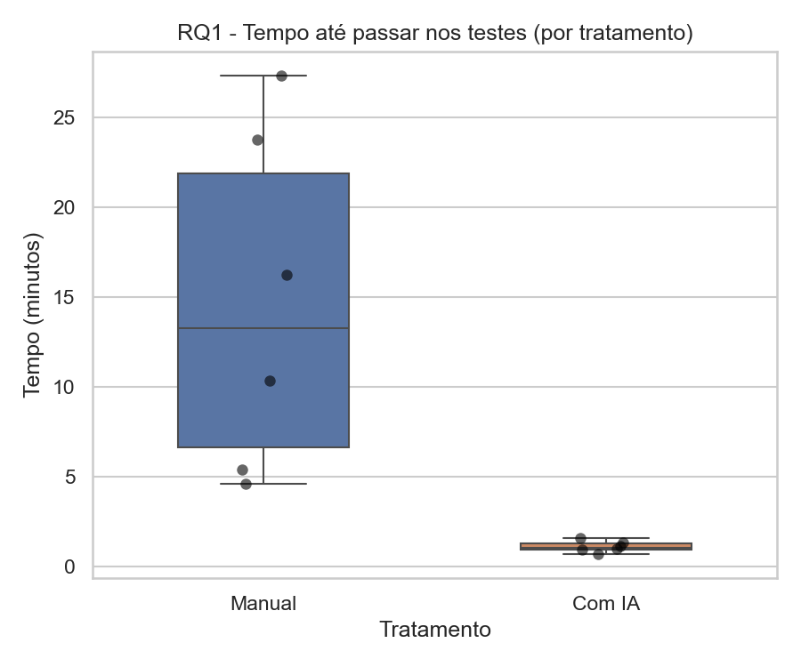

Mediana de **798,5 s (13min18s) manual vs. 65,0 s (1min05s) com IA** — redução
de ~12×. O gráfico a seguir evidencia o pareamento por kata usado no teste de
Wilcoxon: a IA venceu nos 6 de 6 katas.

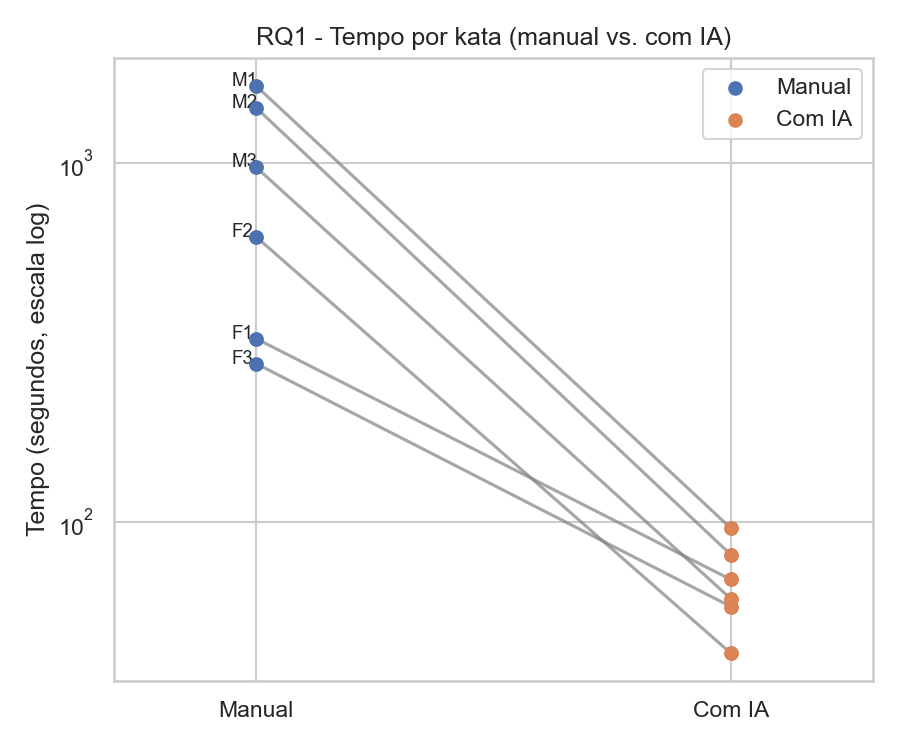

**RQ2 — O uso de IA reduz a quantidade de defeitos?**

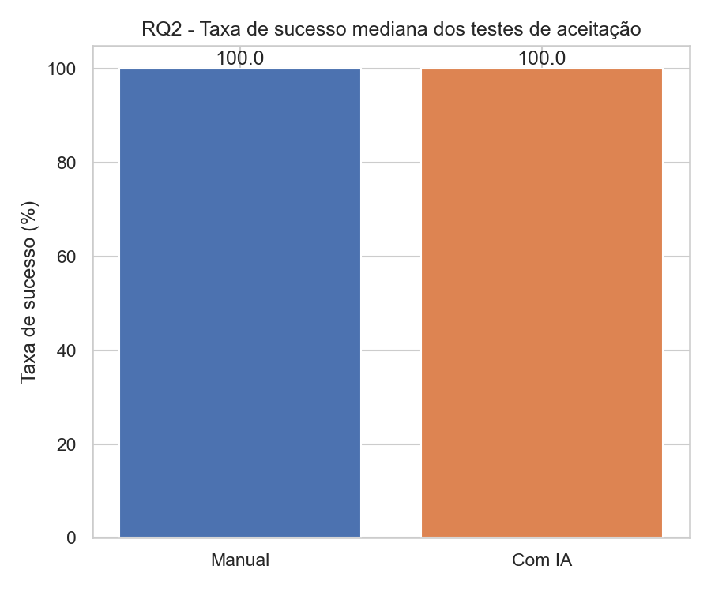

Mediana de **100% em ambos os tratamentos** — sem diferença observável.

**RQ3 — O uso de IA altera a complexidade ciclomática ou a duplicação?**

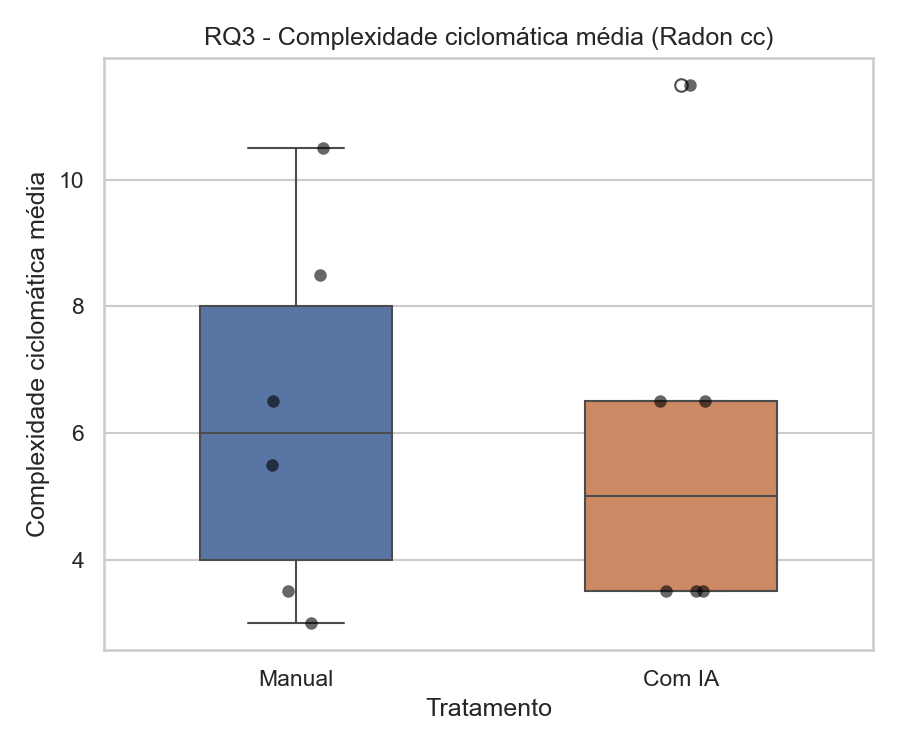

Complexidade ciclomática média: **6,0 manual vs. 5,0 com IA** (p = 0,6845,
não significativo).

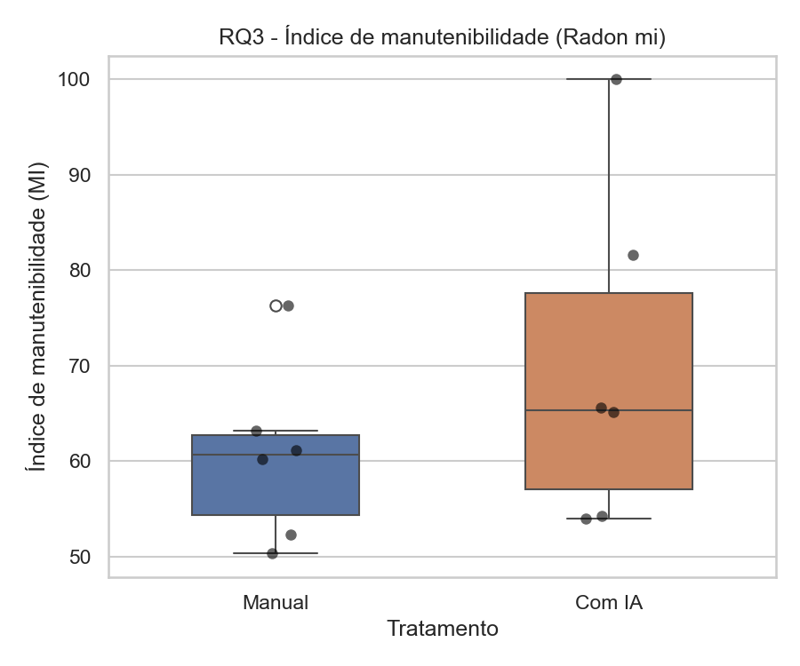

Índice de manutenibilidade: **60,70 manual vs. 65,38 com IA** (p = 0,0312,
significativo).

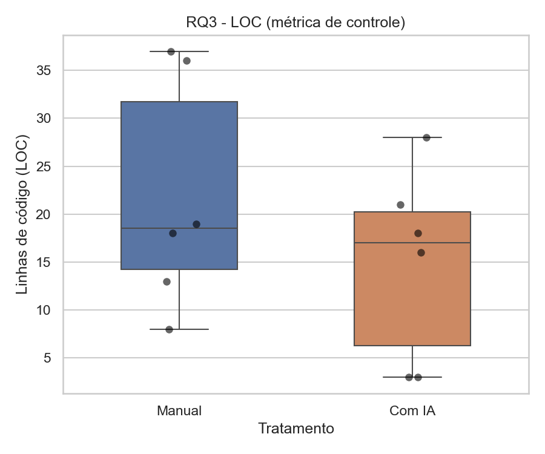

LOC (controle): **18,5 manual vs. 17,0 com IA** (p = 0,0312, significativo).

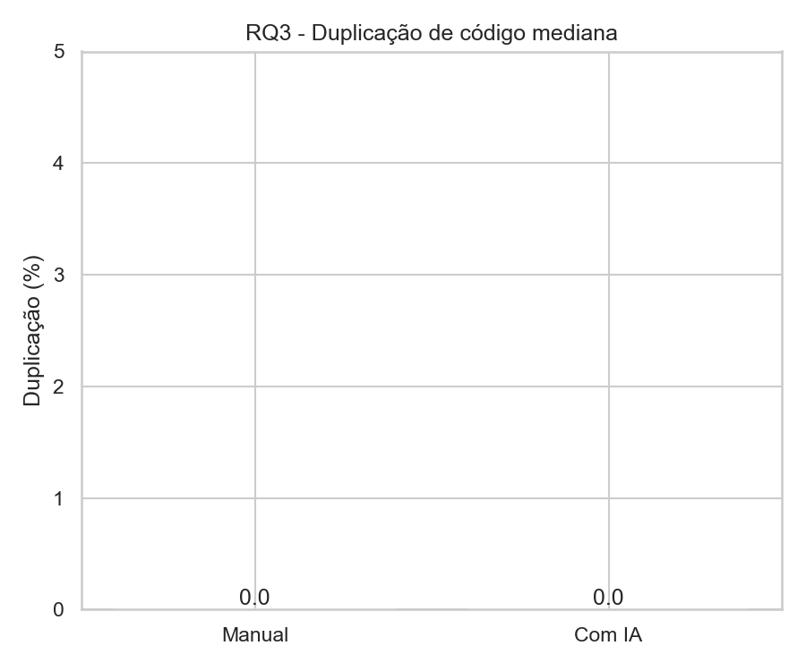

Duplicação: **0% nos dois tratamentos**, em todos os 12 trials.

**Painel consolidado das 3 RQs:**

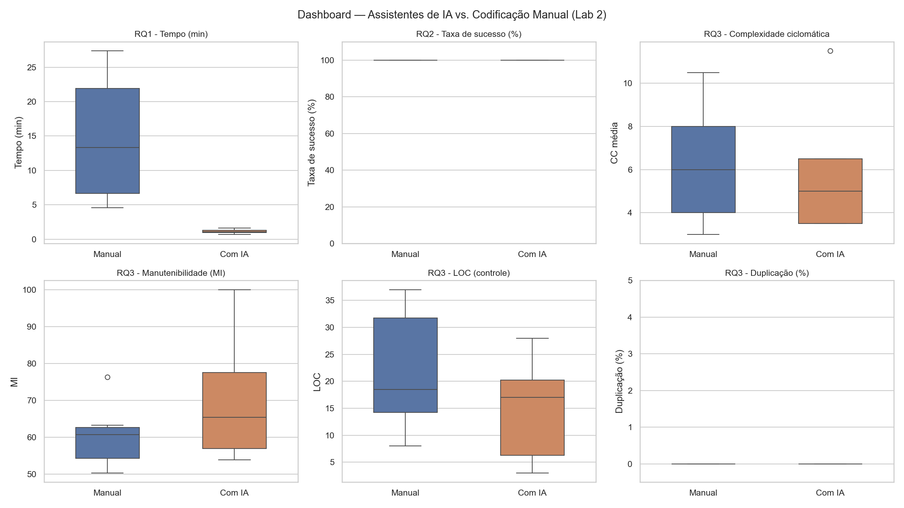

**Inovação — Halstead:**

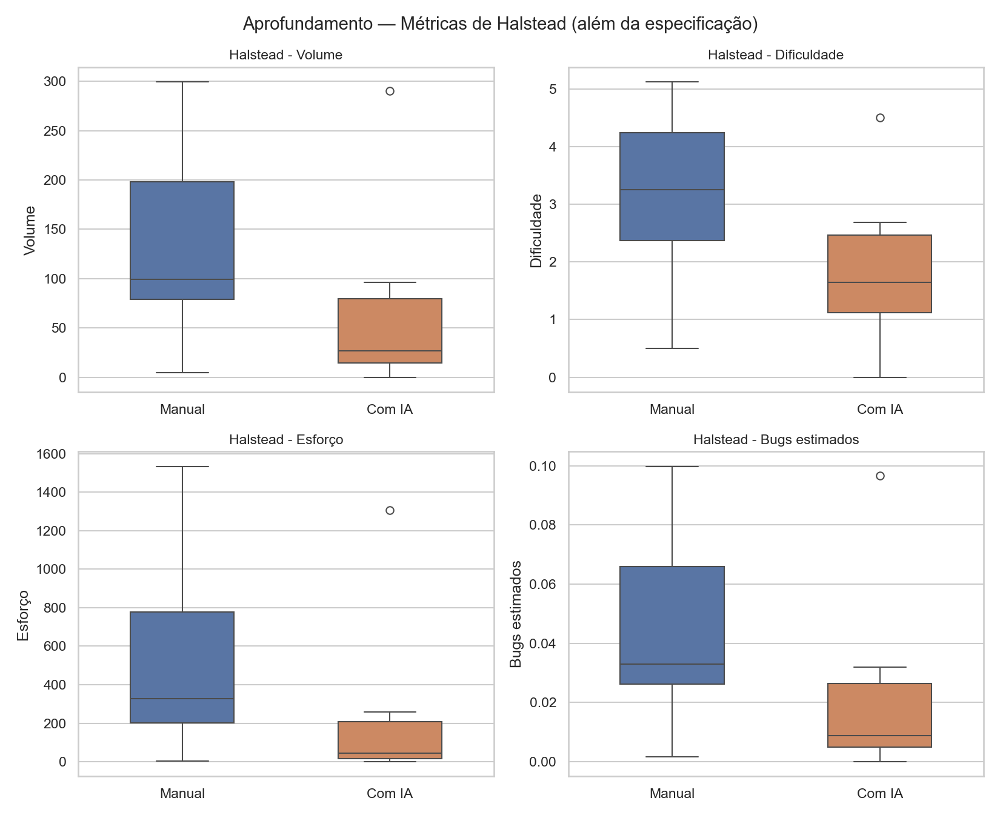

**Inovação — Composição do LOC por tipo:**

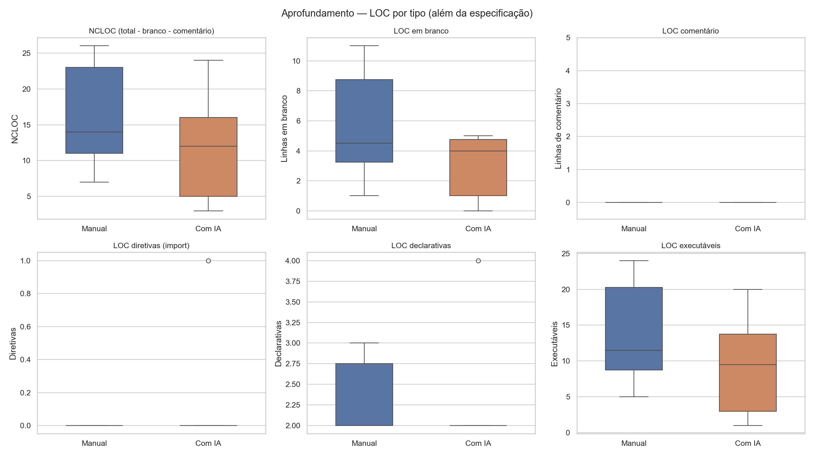

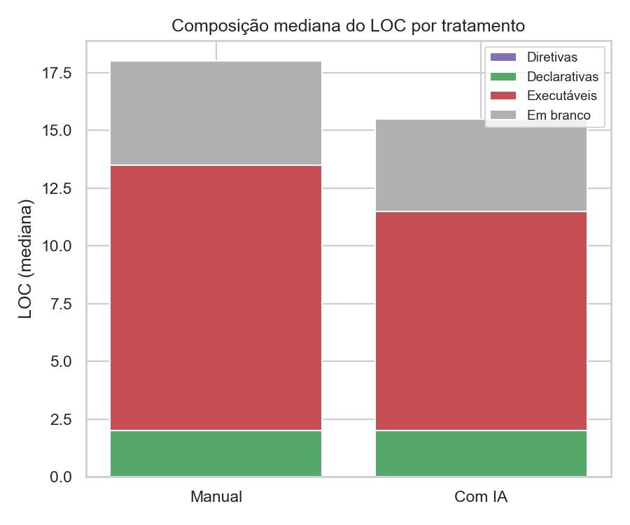

A composição acima mostra visualmente onde a IA "economiza" linhas: o bloco
vermelho (executáveis) e o cinza (em branco) encolhem de manual para IA; o
bloco verde (declarativas) permanece do mesmo tamanho.

*O dashboard interativo (`dashboard.html`, na raiz do repositório) permite
navegar pelas mesmas RQs por abas, alternar a métrica de aprofundamento
exibida, e ver o valor exato de cada kata ao passar o mouse sobre os pontos.*

## 4.3 Discussão

**RQ1 — Confirmada.** Rejeita-se H0: o teste de Wilcoxon pareado por kata deu
p = 0,0312 (< 0,05), com a IA vencendo em 6 de 6 katas e reduzindo o tempo
mediano em cerca de 12×. Esse é o resultado mais forte e menos ambíguo do
experimento — coerente com o esperado, já que resolver um kata de
fácil/média dificuldade é exatamente o tipo de tarefa em que um assistente de
IA generativa tende a se sair bem (padrão de solução relativamente comum,
pouco código).

**RQ2 — Não confirmada, mas não refutada (efeito teto).** O teste de Wilcoxon
não foi aplicável porque todas as 12 execuções atingiram 100% de sucesso, com
ou sem IA — não há variação nos dados para testar. Isso não significa que a
IA "não ajuda" na taxa de defeitos: significa que, para katas de dificuldade
fácil/média resolvidos por um trio com domínio da linguagem, dentro de um
time-box de 35 min (bem mais do que o necessário em todos os casos), tanto a
codificação manual quanto a assistida por IA são suficientes para zerar os
defeitos. Um desenho com katas mais difíceis, ou um time-box mais apertado,
teria mais chance de revelar diferença nessa RQ.

**RQ3 — Parcialmente confirmada.** A hipótese alternativa (uso de IA altera
complexidade e/ou duplicação) foi confirmada para **LOC** e **MI**
(p = 0,0312 em ambos), mas não para **complexidade ciclomática bruta**
(p = 0,6845) nem para **duplicação** (sem variação, 0% nos dois tratamentos).
Um achado que chamou atenção do grupo: ao normalizar a complexidade por 100
linhas de código, a IA mostra uma tendência (não significativa, p = 0,0938)
de complexidade mais concentrada por linha — plausível, já que o código da
IA é mais curto, então a mesma lógica de decisão fica "mais densa".

**Ameaças à validade específicas deste laboratório** (detalhadas no
`README.md`, seção 9): como cada kata foi resolvido por uma pessoa diferente
em cada tratamento (rodízio por pares, seção 3.2), parte do efeito observado
em RQ1/RQ3 pode refletir diferença de habilidade individual entre os três
integrantes, não apenas o uso de IA — limitação assumida em troca de uma
divisão proporcional entre tratamentos. Há também risco residual de
memorização (a IA ou o integrante já conhecerem a solução do kata), mitigado
mas não eliminado pela escolha de katas pouco indexados.

**O que as inovações (seção 3.6) acrescentaram:**

- **Halstead aprofundou RQ3** e trouxe uma tensão interessante com RQ2: as 4
  métricas de Halstead deram significativas (volume, dificuldade, esforço e
  **bugs estimados**, todas menores com IA), sugerindo — por uma via estática,
  baseada na fórmula de Halstead — que o código da IA é menos propenso a
  bugs. Só que isso é uma **proxy estática**, e a RQ2 (medida **empírica**,
  testes de aceitação) não mostrou diferença nenhuma (teto de 100%). Os dois
  sinais não se contradizem tecnicamente — medem coisas diferentes —, mas
  ilustram bem por que "menos bugs estimados por complexidade" não pode ser
  lido como "menos bugs reais observados" sem uma medida empírica que
  discrimine os tratamentos, o que não aconteceu neste desenho.
- **A composição do LOC refinou RQ3**: a redução de LOC da IA (já
  significativa isoladamente) está concentrada no código **executável**
  (p = 0,0312), não nas declarações (p = 1,0 — literalmente idênticas, 2
  linhas de assinatura na mediana dos dois tratamentos) nem nas diretivas de
  import (ocorrência baixíssima: só 1 dos 12 trials tem algum `import`). Ou
  seja, a IA não está "declarando menos coisas" — ela resolve com menos
  passos de lógica.
- **A frente descartada (CK) também é um resultado**, ainda que negativo:
  confirma que métricas de relação entre classes não fazem sentido para um
  corpus de soluções algorítmicas de método único, um limite conhecido mas
  raramente verificado explicitamente ao se aplicar métricas OO fora do
  contexto para o qual foram desenhadas.

# 5. Conclusão

Neste experimento controlado com 6 katas e 12 trials, o uso do assistente de
IA (Claude) **reduziu significativamente o tempo de resolução** (RQ1,
p = 0,0312, ~12× mais rápido) e **alterou a estrutura do código produzido**
em duas dimensões específicas (RQ3): LOC total e código executável menores, e
índice de manutenibilidade maior — sem, no entanto, alterar de forma
significativa a complexidade ciclomática bruta nem a duplicação. Já a RQ2
(defeitos) não pôde ser respondida de forma discriminativa: os katas
escolhidos, dentro do time-box de 35 min, foram fáceis o suficiente para que
ambos os tratamentos chegassem a 100% de sucesso — um resultado tão válido
quanto um "sim" ou "não", mas que aponta para a necessidade de katas mais
desafiadores (ou um time-box mais curto) para discriminar defeitos entre
tratamentos em um estudo futuro.

Vale destacar, no entanto, o contexto em que essa vantagem foi medida: os seis
katas usados são exercícios públicos, de resolução algorítmica direta — um
enunciado bem definido, uma entrada, uma saída, sem ambiguidade de requisito
para interpretar. É exatamente o tipo de problema em que um assistente de IA
generativa tende a reconhecer um padrão já visto em seu treinamento e produzir
uma solução quase de imediato, o que ajuda a explicar por que a vantagem
observada foi tão desproporcional (~12× no tempo mediano). É razoável supor
que esse placar não se repetiria da mesma forma diante de um desafio de outra
natureza — por exemplo, um projeto de software com regras de negócio
próprias, decisões de arquitetura e modelagem de requisitos a partir de uma
especificação ambígua ou incompleta. Nesse cenário, a codificação manual
teria mais chance de competir de igual para igual, já que boa parte do
trabalho deixaria de ser "traduzir um enunciado conhecido em código" e passaria
a ser "entender o problema antes de resolvê-lo" — uma etapa em que o
julgamento humano ainda pesa mais. A conclusão deste laboratório, portanto,
deve ser lida com esse recorte em mente: a IA venceu com folga dentro do tipo
de tarefa testado, não necessariamente dentro de qualquer tarefa de
programação.

As duas inovações aprofundaram exatamente os pontos em que RQ3 ficou
incompleta: Halstead confirmou a redução de "esforço" e "bugs estimados" de
forma consistente (mas estática, não empírica) com a IA, e a classificação de
LOC por tipo mostrou que a economia de linhas da IA é no código executável,
não na "casca" declarativa do programa.

**Principais limitações do estudo:** amostra pequena (N=6 pares por métrica,
o que já força o Wilcoxon à aproximação normal em vez da distribuição
exata); rodízio por pares em vez do mesmo indivíduo nos dois tratamentos de
um mesmo kata, misturando parcialmente habilidade individual ao efeito do
tratamento; katas de dificuldade fácil/média, que geraram efeito teto na
RQ2; e risco residual (não eliminado) de memorização de soluções conhecidas
pela IA.

**O que o grupo faria diferente com mais tempo:** incluir pelo menos um kata
de dificuldade "difícil" por integrante para dar chance à RQ2 de mostrar
diferença de defeitos entre tratamentos; e, com uma amostra maior (mais
katas ou mais integrantes), aplicar o desenho within-subject "puro" (mesma
pessoa nos dois tratamentos do mesmo kata), eliminando a ameaça à validade de
habilidade individual introduzida pelo rodízio por pares. Das inovações
propostas, a classificação de LOC por tipo é a que mais valeria a pena
expandir: com uma amostra maior, seria possível também medir profundidade de
aninhamento (nesting) e comprimento médio de linha como proxies adicionais de
legibilidade, complementando a comparação de estrutura entre manual e IA.

# 6. Referências

- ZUSE, Horst. A framework of software measurement. Walter de Gruyter, 2013.
- BASILI, Victor R.; CALDIERA, Gianluigi; ROMBACH, H. Dieter. The Goal
  Question Metric Approach. Encyclopedia of Software Engineering, Wiley,
  1994.
- HALSTEAD, Maurice H. Elements of Software Science. Elsevier North-Holland,
  1977.
- CHIDAMBER, Shyam R.; KEMERER, Chris F. A metrics suite for object oriented
  design. IEEE Transactions on Software Engineering, v. 20, n. 6, 1994.
- WILCOXON, Frank. Individual comparisons by ranking methods. Biometrics
  Bulletin, v. 1, n. 6, 1945.
